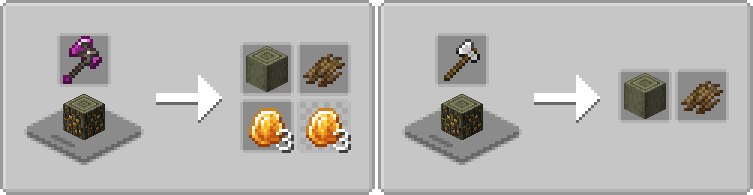
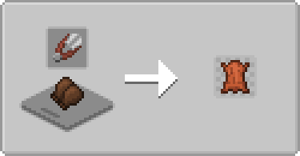

# Farmer's Cutting: The Aether
Adds more [Farmer's Delight](https://modrinth.com/mod/farmers-delight) cutting board recipes for [The Aether](https://modrinth.com/mod/aether)

- Bark, stripping, recycling for skyroot wood
- Amber harvesters can strip Golden Oak on the cutting board for golden amber and bark
    - (Forge/NeoForge) Other axes can strip Golden Oak but will only get bark
    - (Fabric) Other axes cannot strip Golden Oak on the cutting board
- More dye from flowers that give dye
- Leather Gloves recycle into (a chance of) leather

   