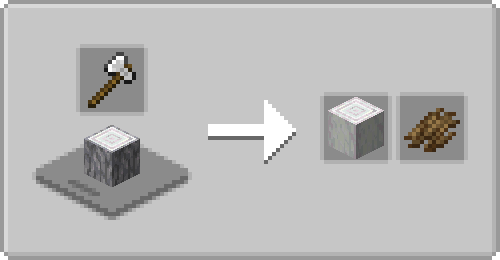

# Farmer's Cutting: Quark
Adds more [Farmer's Delight](https://modrinth.com/mod/farmers-delight) cutting board recipes for [Quark](https://modrinth.com/mod/quark)

- Bark, stripping, recycling for all wood types
- Seed Pouch recycling into leather

 

## Note
Both Farmer's Delight and Quark have crop crates (e.g. Beetroot Crate) that are identical except for looks. I suggest using something like [Polymorph](https://modrinth.com/mod/polymorph) so you can choose which to craft, or remove the recipe for one of them.